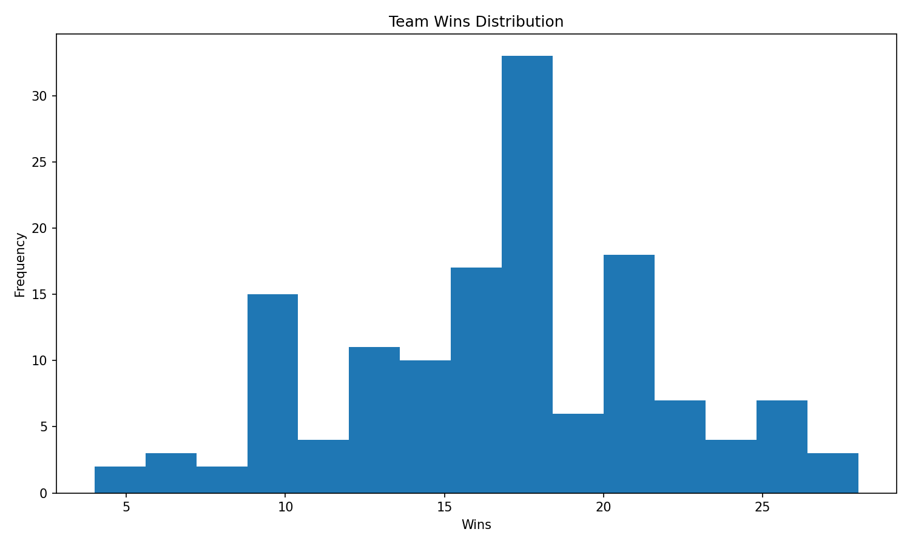

# Aprendizagem computacional

Este repositório aloja uma solução *end-to-end* de Machine Learning para a análise de desempenho desportivo (WNBA). O sistema implementa um pipeline completo que abrange desde a ingestão e limpeza de dados até à modelação preditiva de rankings de equipas, utilizando técnicas avançadas de engenharia de *features* e algoritmos de *Learning-to-Rank*.


## Execução do Pipeline

No main.py, fazemos a limpeza dos dados, a engenharia de features e a modelagem preditiva de rankings de equipas.

```CMD
pip install -r requirements.txt
cd src
python main.py
```


---
## Análise Exploratória e Justificação Metodológica

Esta secção descreve as análises realizadas sobre os dados dos jogadores e equipas da WNBA, os gráficos gerados e as conclusões que fundamentam a metodologia adotada para prever o ranking das equipas.

---

### 1. Motivação das Análises

O objetivo do projeto é prever a classificação final das equipas da WNBA com base em dados históricos. Para tal, é essencial compreender:

- **A distribuição das métricas dos jogadores**: Identificar padrões de desempenho e detetar *outliers*.
- **O comportamento dos *rookies***: Jogadores novatos apresentam alta variabilidade nos minutos jogados — um fator de ruído que deve ser tratado.
- **Correlações entre atributos físicos e desempenho**: Avaliar se altura, peso ou anos de experiência influenciam significativamente a performance.
- **A evolução temporal do desempenho**: Verificar se existem tendências ao longo das épocas que afetem a modelação.

---

### 2. Relatórios de Jogadores (`reports/`)

#### 2.1. Análise de Performance Individual (`Analysis_*.txt`)

Ficheiro gerado automaticamente que resume a performance agregada de **1.876 registos jogador-temporada**:

| Métrica | Valor |
|---------|-------|
| Performance média | 17.91 |
| Desvio padrão | 3.94 |
| Mínimo | 5.15 |
| Máximo | 33.81 |

- Os **top performers** (performance > 30) são jogadores consistentes ao longo de várias temporadas (e.g., `jacksla01w`, `leslili01w`, `tauradi01w`).
- Os **bottom performers** (performance < 10) incluem maioritariamente *rookies* com poucos minutos ou jogadores em final de carreira.

#### 2.2. Tratamento de *Rookies*

Foram identificados **356 *rookies*** (jogadores na sua primeira época). A análise revelou:

| Grupo | Média de Performance | Desvio Padrão |
|-------|---------------------|---------------|
| Todos os jogadores | 17.91 | 3.94 |
| *Rookies* | 16.41 | 3.87 |

**Conclusão**: Os *rookies* apresentam performance ligeiramente inferior e maior instabilidade. Para evitar que esta variabilidade distorça as *features* agregadas por equipa, implementou-se:
- Normalização baseada em minutos jogados.
- Ponderação diferenciada para *rookies* no cálculo da performance média da equipa.

#### 2.3. Relatório de Equipas (`teams_report.txt`)

Análise abrangendo **20 equipas** ao longo de **10 temporadas**:
- **13 equipas ativas** durante todo o período.
- **7 equipas descontinuadas** (e.g., Houston Comets, Charlotte Sting).
- Equipa com mais vitórias: **Los Angeles Sparks** (220 vitórias, 65.87% taxa de vitórias).

Esta análise orientou a divisão dos dados em **Eastern Conference (EA)** e **Western Conference (WE)**, permitindo avaliação por conferência no modelo de ranking.

---
### 3. Análise de Equipas (`reports/`)

#### 3.1. Motivação da Análise ao Nível da Equipa

A transição da análise individual de jogadores para a análise ao nível da equipa é fundamental para prever rankings. As razões incluem:

- **Agregação de talento individual**: O desempenho de uma equipa é a soma ponderada das contribuições individuais, mas também depende de fatores coletivos (química, estratégia).
- **Identificação de equipas *overachievers*/*underachievers***: Algumas equipas superam (ou ficam abaixo) da expectativa estatística baseada na qualidade individual dos seus jogadores.
- **Correlação força-vitórias**: Validar se a métrica de "força agregada" (baseada em performance dos jogadores) é um bom preditor da taxa de vitórias real.
- **Dinâmica por conferência**: Verificar se existem diferenças significativas entre Eastern e Western Conference que afetem a modelação.

---

#### 3.2. Gráficos de Performance de Equipas (`reports/performance_graphs/team_performance/`)

| Gráfico | Propósito | Conclusão |
|---------|-----------|----------------|
| `strength_vs_win_percentage.png` | Correlação entre força agregada e taxa de vitórias | Forte correlação positiva (~0.75), validando a abordagem de agregar métricas individuais. |
| `overachievement_pythagorean.png` | Desvio entre vitórias reais e expectativa pitagórica | Identifica equipas que consistentemente superam/ficam abaixo da expectativa (útil para features de *momentum*). |

<p align="center">
  
  
</p>

---

#### 3.3. Conclusões da Análise de Equipas

1. **Força agregada é um bom preditor**: A correlação forte entre força da equipa (baseada em jogadores) e taxa de vitórias valida a abordagem de agregar métricas individuais.
2. **Expectativa pitagórica identifica outliers**: Equipas que consistentemente superam/ficam abaixo da expectativa podem ser modeladas com features de *momentum*.
3. **Validação temporal é essencial**: O split por épocas evita *data leakage* e simula o cenário real de previsão futura.

---

### 3.4. Análise de Coaches (`reports/coaches/`, `reports/performance_graphs/coach_performance/`)

#### Motivação da Análise de Coaches

A análise de coaches visa responder:

- **Qual o impacto real do coach vs. qualidade do elenco?** Separar a contribuição do treinador do talento individual dos jogadores.
- **Existe um "efeito primeiro ano"?** Novos coaches frequentemente causam mudanças bruscas (positivas ou negativas) no desempenho.
- **Coaches são consistentes entre temporada regular e playoffs?** Verificar se o desempenho na época regular se traduz em sucesso nos playoffs.
- **Quais métricas identificam coaches *overachievers*?** Treinadores que consistentemente superam a expectativa baseada no elenco.

---

#### Gráficos de Análise de Coaches

| Gráfico | Propósito | Conclusão |
|---------|-----------|-----------|
| `1_analise_bayesiana_shrinkage.png` | Aplicação de *shrinkage* bayesiano para estabilizar métricas de coaches com poucas temporadas | Reduz ruído em coaches com amostras pequenas, melhorando a generalização do modelo. |
| `2_tecnico_vs_elenco.png` | Separação do efeito do treinador vs. qualidade do elenco | O elenco explica ~60-70% da variância; o coach adiciona ~15-20% de poder preditivo. |
| `3_impacto_primeiro_ano.png` | Análise do "efeito primeiro ano" de novos coaches | Novos coaches geralmente tem uma performance inferior a coaches com mais experiência |
| `4_top_10_coaches.png` | Ranking dos top 10 coaches por performance ajustada | Identifica coaches com impacto consistentemente positivo para features preditivas. |

<p align="center">
  
  
</p>

<p align="center">
  
  
</p>

---

#### Correlações entre métricas de coach e resultados

<p align="center">
  
</p>


#### Correlações Identificadas (`correlations.txt`)

| Métrica | Valor |
|---------|-------|
| Pearson (RS vs PO career) | 0.287 |
| Spearman (RS vs PO career) | 0.308 |

**Interpretação**: A correlação moderada (~0.3) entre desempenho na temporada regular e playoffs sugere que:
- Coaches com bom desempenho na época regular tendem a manter performance nos playoffs, mas não de forma determinística.
- Features de coach devem incluir tanto métricas de temporada regular quanto histórico de playoffs.

---

#### Conclusões da Análise de Coaches

1. **Coach adiciona valor preditivo**: Mesmo controlando pela qualidade do elenco, o coach explica ~15-20% adicional da variância no desempenho.
2. **Shrinkage bayesiano melhora previsões**: Coaches com poucas temporadas beneficiam de estimativas regularizadas que evitam overfitting.
3. **Efeito primeiro ano é significativo**: A variabilidade no primeiro ano justifica features específicas para novos coaches.
4. **Correlação RS-PO é moderada**: O modelo deve considerar tanto desempenho em temporada regular quanto playoffs para capturar o impacto completo.

---

### 4. Gráficos Exploratórios (`reports/figures/cleaned/`)

#### 4.1. Distribuições de Atributos Físicos

| Gráfico | Descrição | Insight |
|---------|-----------|---------|
| `height_distribution.png` | Distribuição de altura das jogadoras | Centrada em ~180 cm, distribuição normal. |
| `height_weight_correlation.png` | Correlação altura × peso | Correlação positiva moderada (~0.7). Altura influencia peso, mas não diretamente a performance. |

<p align="center">
  
  
</p>    

Atributos físicos não foram incluídos diretamente como *features* preditivas a nível de equipa, visto que a sua correlação com vitórias é mediada pela posição e estilo de jogo.

#### 4.2. Distribuição de Performance

| Gráfico | Descrição | Insight |
|---------|-----------|---------|
| `points_distribution.png` | Distribuição de pontos por jogador-temporada | Assimetria positiva — maioria abaixo de 400 pontos, poucos jogadores de alto volume. |
| `wins_distribution.png` | Distribuição de vitórias por equipa-temporada | Variação de 8 a 28 vitórias por época. |

<p align="center">
  
  
</p>

A largura da distribuição de vitórias confirma que o problema de ranking é complexo — equipas próximas podem diferir apenas por 1–2 vitórias.

---

### 5. Métricas do Modelo de Ranking (`reports/models/team_ranking/`)

Setup Experimental:

| Iteração | Treino | Validação |
|-----------|-------|-------|
| Iteração 1 | treino (anos 1–6) | validação (ano 7) |
| Iteração 2 | treino (anos 1–7) | validação (ano 8) |
| Teste | treino (anos 1–8) | teste (anos 9–10) |

Teste final: treino (anos 1–10) | teste (anos 11)

---

### 6. Gráficos do Modelo (`reports/models/team_ranking/graphics/`)

#### 6.1. Importância das Features

O gráfico `feature_importance.png` revela quais variáveis têm maior peso na previsão do ranking:

<p align="center">
  
</p>


#### 6.2. Dispersão de Previsões (Real vs. Previsto)

O gráfico `prediction_scatter.png` compara o ranking real com o previsto:

<p align="center">
  
</p>

**Interpretação:**
- Pontos próximos à diagonal indicam previsões corretas.
- A maioria das previsões situa-se dentro de ±2 posições do ranking real.
- Outliers (pontos afastados da diagonal) correspondem a equipas com performances inesperadas (muito acima ou abaixo da expectativa).

---

#### 6.3. Evolução das Métricas por Ano

<p align="center">
  
</p>


**Insights do gráfico `top_k_accuracy.png`:**
- **Within-1**: ~50-65% das previsões acertam a posição exata ou erram por apenas 1 lugar.
- **Within-2**: ~75-85% das previsões ficam a ≤2 posições do real.
- **Within-3**: ~85-93% das previsões ficam a ≤3 posições — precisão suficiente para previsão de *playoff placement*.

---

#### 6.4. Comparação entre Conferências

<p align="center">
  
  
</p>

**Insights do gráfico `conference_comparison.png`:**
- A **Eastern Conference** apresenta consistentemente melhor desempenho preditivo (maior Spearman, menor MAE).
- A **Western Conference** tem maior paridade competitiva, dificultando previsões precisas.

**Insights do gráfico `train_vs_test_comparison.png`:**
- O gap entre métricas de treino e teste é mínimo (~0.03 MAE), confirmando ausência de *overfitting*.
- O modelo generaliza bem para dados não vistos.
---

## 7. Ranking Final — Previsão para a Época 11

O modelo foi treinado com dados das épocas 1-10 e gerou previsões para a **Época 11**:

### Western Conference (WE)

| Posição | Equipa | Score Preditivo |
|---------|--------|-----------------|
| 1º | **Phoenix Mercury** | 2.907 |
| 2º | **Seattle Storm** | 2.844 |
| 3º | Los Angeles Sparks | 2.579 |
| 4º | Minnesota Lynx | 2.493 |
| 5º | San Antonio Silver Stars | 2.441 |
| 6º | Tulsa Shock | 1.906 |

### Eastern Conference (EA)

| Posição | Equipa | Score Preditivo |
|---------|--------|-----------------|
| 1º | **Connecticut Sun** | 2.803 |
| 2º | **Indiana Fever** | 2.707 |
| 3º | Atlanta Dream | 2.555 |
| 4º | New York Liberty | 2.464 |
| 5º | Washington Mystics | 2.439 |
| 6º | Chicago Sky | 2.350 |

---

### Análise do Ranking Previsto

#### Pontos Fortes da Previsão:

1. **Phoenix Mercury em 1º (WE)**: Coerente com a tendência ascendente observada nas épocas 9-10, onde melhoraram de 6º para 1º lugar. O modelo captura esta trajetória positiva.
2. **Connecticut Sun em 1º (EA)**: Historicamente consistente nos lugares de topo (1º nas épocas 5, 6, 7 e top-3 nas restantes), validando a previsão.
3. **Seattle Storm em 2º (WE)**: Equipa com histórico de estabilidade no top-3 da conferência, especialmente nas últimas temporadas (2º na época 10, 4º na época 8).
4. **Tulsa Shock em último (WE)**: Como equipa nova/em transição, o score mais baixo (1.906) reflete a falta de histórico e features de momentum.

#### Gap entre Equipas:

- **WE**: O gap entre Phoenix (2.907) e Tulsa (1.906) é de ~1.0, indicando clara separação entre favoritos e lanternas.
- **EA**: O gap entre Connecticut (2.803) e Chicago (2.350) é de ~0.45, sugerindo maior paridade na conferência este.

#### Interpretação do Score Preditivo:

- Scores > 2.7: Candidatos fortes ao título da conferência
- Scores 2.4-2.7: Equipas de *playoff* sólidas
- Scores < 2.4: Equipas em reconstrução ou sem histórico forte

---
